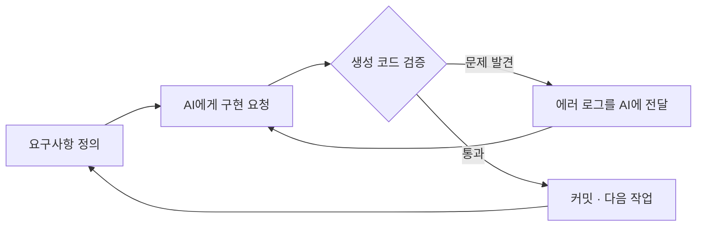
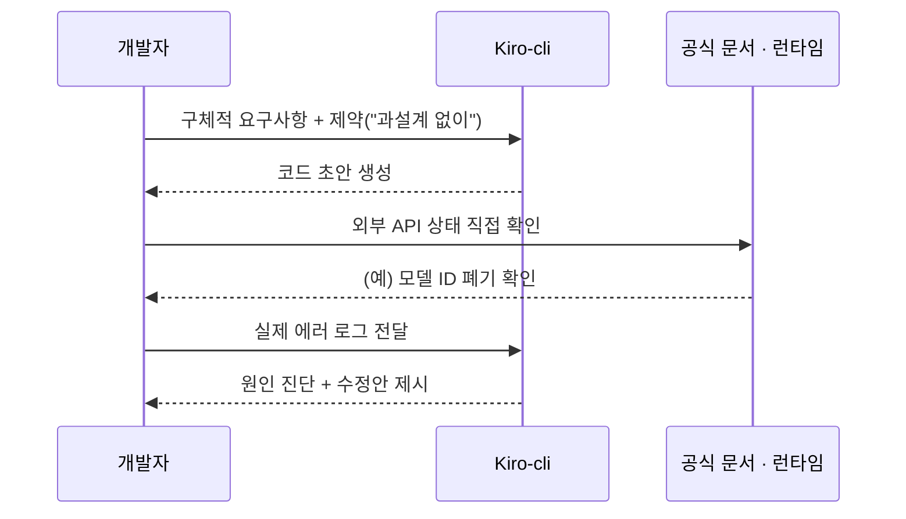
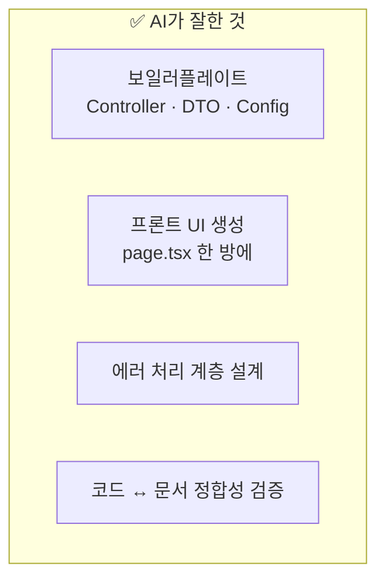
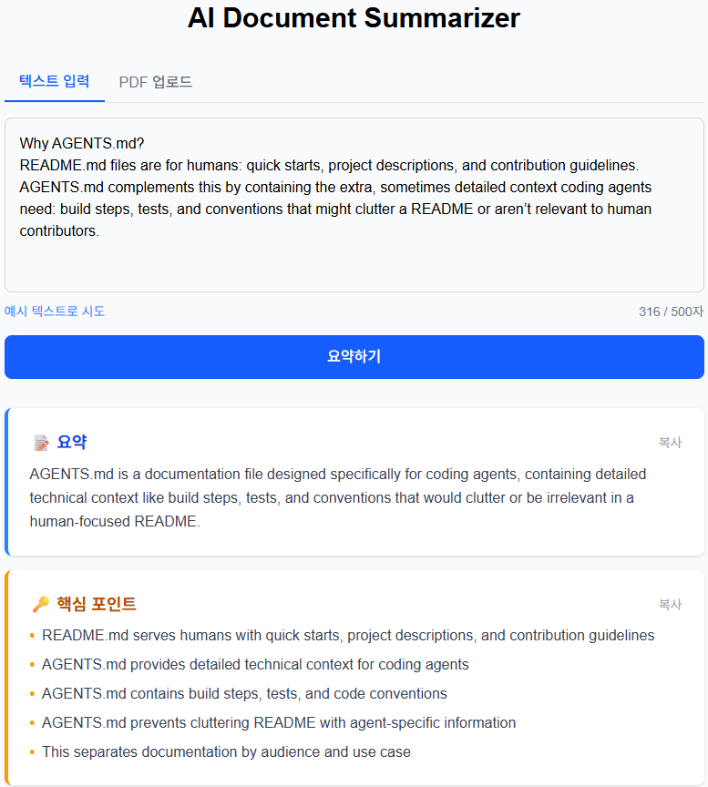
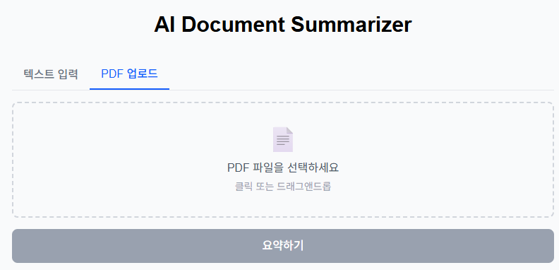
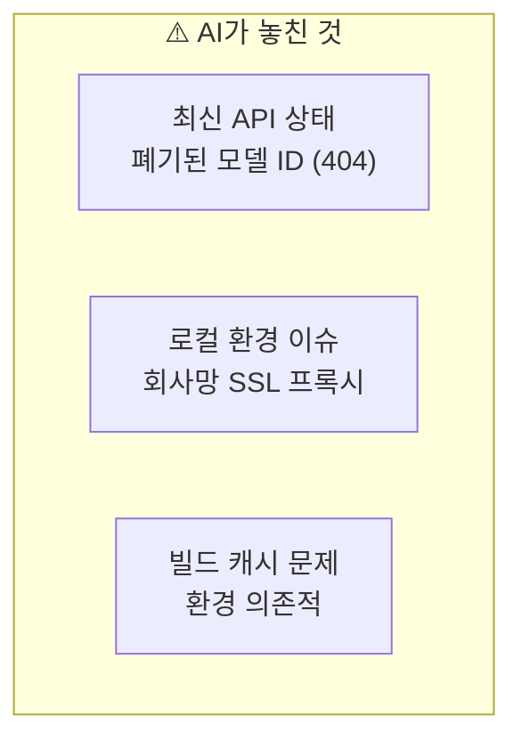
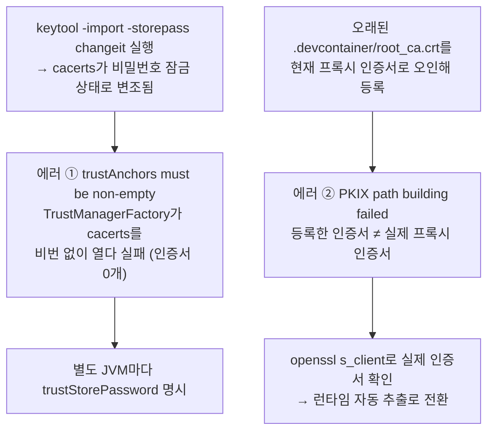
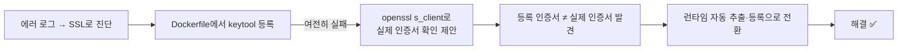

<!--
velog 발행용 초안
- 시리즈: 완벽주의 대신 완성
- 제목: 완벽주의 대신 완성 #2 — Kiro-cli로 AI 코딩 에이전트와 2주 개발하기
- 태그: AI개발, KiroCLI, ClaudeAPI, 개발생산성, 회고
- 썸네일: docs/images/summarize.png 권장
- 이미지: 아래 경로는 repo 기준 상대경로입니다. velog 발행 시 이미지를 직접 업로드해 URL을 교체하세요.
- Mermaid: velog는 ```mermaid 코드블록 렌더링을 지원합니다.
-->

# 완벽주의 대신 완성 #2 — Kiro-cli로 AI 코딩 에이전트와 2주 개발하기

> **완벽주의 대신 완성** 시리즈 두 번째 글. [1편](#)에서 "2주 만에 AI 문서 요약 서비스를 만들어 배포한" 과정을 회고했다면, 이번 편은 그 2주 동안 **AI 코딩 에이전트(Kiro-cli)를 실제로 어떻게 썼는지** — 어디서 시간을 벌고, 어디서 함정에 빠졌는지를 정리한다.

## 들어가며 — 개발 방식

이 프로젝트의 개발 루프는 단순했다. **요구사항을 정의하고, AI에게 구현을 시키고, 결과를 검증한다.** 문제가 생기면 에러 로그를 그대로 AI에게 던져 다시 돈다.



핵심 원칙은 세 가지였다.
- AI에게 **명확한 요구사항**을 준다.
- 생성된 코드를 **맹신하지 않고 검증**한다.
- **삽질도 기록**한다.

이 글은 그 루프를 2주간 돌리며 체득한, "AI에게 무엇을 맡기고 무엇을 맡기면 안 되는가"에 대한 기록이다.

## AI에게 어떻게 일을 시켰나

같은 AI라도 프롬프트에 따라 결과 품질이 크게 갈렸다. 2주간 체감한 좋은/나쁜 프롬프트의 차이.

| 좋은 프롬프트 | 나쁜 프롬프트 |
|-------------|-------------|
| 구체적인 입출력 명시 | "API 만들어줘" |
| 사용할 라이브러리 지정 | 선택지를 AI에게 맡김 |
| 제약 조건 명시 ("과설계 없이") | 아무 조건 없이 요청 |
| 한 번에 하나의 작업 | 여러 작업을 한꺼번에 |

특히 **작은 단위로 쪼개 요청**하는 게 정확도를 크게 높였다. Day 8 PDF 업로드 기능은 "PDF 업로드 전체 구현해줘"가 아니라 백엔드 → 프론트 → 드래그앤드롭으로 나눠 요청했더니 별도의 수정이 필요 없을 정도로 완성도가 높았다.

그리고 외부 API가 얽힌 부분은 AI 출력을 그대로 믿지 않고 **공식 문서/런타임으로 교차 검증**하는 단계를 항상 끼워 넣었다.



이 '직접 확인' 습관이 필요했던 이유는, **LLM 출력이 프롬프트만으로는 통제되지 않기** 때문이다. system 프롬프트에 `no markdown, JSON만 응답`이라고 못 박았는데도 Claude는 응답을 코드블록으로 감쌌고, Jackson은 첫 글자 backtick에서 터졌다.

```
com.fasterxml.jackson.core.JsonParseException: Unexpected character ('`' (code 96))
```

결국 프롬프트로 "하지 마"라고 지시하는 대신, 파싱 전에 코드블록을 벗겨내는 방어 코드로 해결했다. **LLM 연동에서 출력 전처리는 선택이 아니라 기본 패턴이다.**

````java
content = content.strip();
if (content.startsWith("```")) {
    content = content.replaceFirst("```(?:json)?\\s*", "");
    content = content.replaceFirst("\\s*```$", "");
}
return mapper.readValue(content, SummarizeResult.class);
````

> 📄 상세 기록: `docs/troubleshooting/2026-05-06-claude-markdown-response.md`

## AI가 잘한 것

2주를 돌아보면, AI가 압도적으로 시간을 줄여준 영역이 분명했다.



**1) 보일러플레이트 — record DTO로 시작**

"과설계 없이"라는 제약을 주자, 딱 필요한 만큼만 만들었다.

```java
@RestController
@RequestMapping("/api")
public class SummarizeController {
    record SummarizeRequest(String text) {}
    record SummarizeResponse(String summary) {}

    @PostMapping("/summarize")
    public SummarizeResponse summarize(@RequestBody SummarizeRequest request) {
        return new SummarizeResponse("TODO: AI 요약 결과");
    }
}
```

프로젝트 생성부터 첫 API 동작까지 **30분 이내**. 패키지 구조를 직접 구상할 필요가 없어 시간이 많이 단축되었다.

**2) 프론트엔드 UI — AI의 최강 영역**

"Next.js + TailwindCSS로 요약 서비스 메인 페이지, textarea + 버튼 + 결과 카드, 로딩/에러 포함"이라는 요구사항 하나로 100줄짜리 `page.tsx`가 **수정 없이 바로 동작**했다.

**3) 에러 처리 계층 설계**

백엔드 예외 계층을 HTTP 상태코드 의미에 맞게 자연스럽게 분리해줬다.

```java
@RestControllerAdvice
public class GlobalExceptionHandler {
    @ExceptionHandler(ResponseStatusException.class)  // 400 등 원래 코드
    @ExceptionHandler(RuntimeException.class)          // 502 AI 연동 오류
    @ExceptionHandler(SocketTimeoutException.class)    // 504 타임아웃
    @ExceptionHandler(Exception.class)                 // 500 기타
}
```

프론트 쪽도 fetch의 특성을 살려 네트워크 에러와 서버 에러를 정확히 구분했다.

```typescript
catch (err) {
  if (err instanceof TypeError) {
    setError("서버에 연결할 수 없습니다. 백엔드가 실행 중인지 확인해주세요.");
  } else {
    setError(err instanceof Error ? err.message : "요약 중 오류가 발생했습니다.");
  }
}
```

**4) 코드-문서 정합성**

Day 10 README 작업에서 인상적이었던 건, "코드 먼저 읽고 문서화해"라고 시키지 않아도 AI가 `SummarizeController.java`의 실제 validation(500자, 10MB)을 확인한 뒤 API 명세를 썼다는 점이다. 사람이 문서를 쓰면 코드 변경을 놓치기 쉬운데, AI는 매번 소스를 다시 확인하는 경향이 있었다.

이 결과물 화면들은 대부분 위 방식으로 만들어졌다.

| AI로 만든 요약 결과 UI | AI로 만든 PDF 업로드 UI |
|:---:|:---:|
|  |  |

## AI가 못한 것 · 함정

반대로, AI가 자신 있게 틀리거나 손대지 못한 영역도 뚜렷했다.



AI가 이미 폐기된 모델을 설정하였다.

```java
// AI가 생성한 원본 (404, 동작 안 함)
"model", "claude-3-5-haiku-20241022"

// 직접 수정 (동작함)
"model", "claude-haiku-4-5-20251001"
```

AI의 학습 데이터엔 시점 한계가 있다. **모델 ID, 엔드포인트 URL, 인증 방식 같은 외부 API의 "현재 상태"는 반드시 공식 문서로 확인해야 한다.** 이것이 검증 단계를 루프에 고정으로 넣은 이유다.

> 📄 상세 기록: `docs/ai-issues/2026-05-04-claude-model-deprecation.md`

로컬 환경 이슈(회사망 SSL 프록시)와 빌드 캐시 문제도 AI가 코드만 보고는 해결하지 못했다. 실제 로그와 시행착오가 필요한 영역이었다.

## 삽질에서 AI의 디버깅 역할

그렇다고 AI가 디버깅에 무력했던 건 아니다. **에러 로그를 통째로 던지면** 원인 추적을 잘 이끌었다. 잘한 케이스와 아쉬운 케이스가 갈렸다.

### 케이스 1 — SSL 인증서: 같은 증상, 다른 범인 (잘한 케이스)

이 프로젝트에서 가장 끈질겼던 게 회사 내부망 SSL 프록시 문제다. 흥미로운 건 "SSL이 안 된다"는 같은 증상 뒤에 **서로 다른 두 범인**이 있었다는 점이다.



**에러 ① `trustAnchors parameter must be non-empty` (Day 2, 로컬).**
진짜 범인은 프록시 인증서가 아니라 `keytool`이었다. `keytool -import -storepass changeit`이 cacerts를 **비밀번호로 보호된 PKCS12로 다시 저장**하는 바람에, cacerts를 비밀번호 없이(null) 읽는 `TrustManagerFactory`가 인증서를 하나도 못 읽었다(원본 97개 → 0개). 그래서 "신뢰 목록이 비었다"는 오류가 난 것. 해결은 루트 CA 등록 + `-Djavax.net.ssl.trustStorePassword=changeit`.

**에러 ② `PKIX path building failed` (Day 5, Docker).**
이번엔 전혀 다른 범인이었다. 프로젝트에 있던 `.devcontainer/root_ca.crt`를 "현재 프록시 인증서"라고 가정하고 등록했는데, 알고 보니 **프록시 장비가 교체되기 전의 오래된 인증서**였다(등록: `CN=OldProxy` vs 실제: `CN=ProxySSL`). 파일명만 보고 넘겨짚은 게 실수였다. 여기서 AI가 단계적으로 잘 좁혔다.



`openssl s_client -connect api.anthropic.com:443`으로 **실제로 제시되는 인증서를 먼저 확인하자**는 제안이 전환점이었다. 다만 채택한 런타임 자동 추출 방식은 "컨테이너가 그 순간 받은 인증서를 무조건 신뢰"하므로 MITM에 취약하다는 트레이드오프가 있다. 개인 프로젝트 규모라 감수했지만, 운영 환경이라면 부적절하다는 점도 기록에 함께 남겨뒀다.

**그리고 AI는 반복 패턴을 기억했다.** 같은 SSL 계열 문제가 Day 8 Gradle 빌드에서 또 터졌을 때(`trustAnchors` 재등장), AI는 "Gradle 데몬도 별도 JVM이라 trustStorePassword가 필요하다"고 즉시 진단했다. 근본 원인은 하나였다 — keytool이 cacerts를 잠갔고, **JVM 프로세스는 저마다 독립**이라 설정을 각자 알려줘야 했다.

| 실행 주체 (별도 JVM) | 설정 위치 |
|---|---|
| Spring Boot 앱 (IntelliJ) | Run Configuration → VM options |
| Gradle 의존성 다운로드 | `gradle.properties` → `org.gradle.jvmargs` |
| Docker 컨테이너 | Dockerfile ENTRYPOINT |

> 📄 상세 기록: `docs/troubleshooting/2026-05-04-ssl-trustanchors-issue.md`, `2026-05-10-docker-ssl-proxy-ca.md`, `2026-05-20-truststore-password-multiple-jvms.md`

### 케이스 2 — Turbopack 캐시 (아쉬운 케이스)

`npm run dev`에서 `Can't resolve 'tailwindcss'`. `frontend`에서 실행하는데도 **상위 디렉토리**에서 tailwindcss를 찾고 있었다. 범인은 예전에 루트에 `package-lock.json`이 있던 시절 빌드된 `.next` 캐시였다. Turbopack이 그때의 상위 경로 resolve 결과를 계속 캐싱했고, `package-lock.json`을 지운 뒤에도 캐시가 갱신되지 않았다.

AI는 turbopack root 설정, 루트 `package.json` 추가를 **두 번 시도해 실패한 뒤에야** `.next` 삭제로 해결했다. 환경 상태에 의존하는 캐시 문제는 코드만 봐선 알 수 없어, AI도 시행착오가 필요했다.

> 📄 상세 기록: `docs/troubleshooting/2026-05-15-turbopack-cache-resolve.md`

정리하면 — **코드·설정 기반 문제는 AI가 강하고, 환경 상태에 의존하는 문제(캐시·네트워크 인증서)는 사람의 시행착오가 필요했다.** 대신 그 시행착오를 문서로 남겨두면, 다음 번 같은 계열 문제에서 AI가 패턴을 훨씬 빨리 잡는다.

## 생산성 체감

Day 1~2 기준으로 체감한 시간 차이.

| 작업 | AI 없이 (예상) | AI 활용 (실제) |
|------|--------------|--------------|
| 프로젝트 초기 세팅 | 1시간 | 15분 |
| Controller + DTO | 30분 | 5분 |
| Claude API 연동 코드 | 1시간 | 10분 |
| 디버깅 (SSL + 모델 ID) | — | 2시간 |

코드 작성 자체는 압도적으로 빨라졌지만, **AI가 만든 코드의 디버깅(특히 환경/외부 API)에는 여전히 사람의 시간이 든다.** 그래도 총합은 확실히 빨랐다.

## AI 활용 5가지 교훈

1. **구체적으로, 작게 쪼개서 시켜라.** 입출력·라이브러리·제약을 명시하고 한 번에 한 작업만. 정확도가 눈에 띄게 오른다.
2. **외부 API의 "현재 상태"는 직접 확인하라.** 모델 ID·엔드포인트·인증은 AI가 과거 시점 지식으로 틀릴 수 있다.
3. **에러 로그를 통째로 던져라.** 스택트레이스 전체를 주면 AI의 원인 추적이 빨라진다.
4. **환경 의존 문제는 기대치를 낮춰라.** SSL·빌드 캐시 같은 문제는 시행착오가 필요하다. AI는 방향을, 판단은 내가.
5. **AI는 초안, 검증은 나.** 이 경계를 지키는 순간 AI는 리스크가 아니라 가속기가 된다.

## 마치며

2주간 AI 코딩 에이전트와 함께 개발하며 얻은 결론은 단순하다. **AI는 "빠른 초안 생성기"이자 "성실한 디버깅 파트너"지만, 최신성·환경·최종 판단은 사람의 몫이다.** 이 경계를 지키니 완벽주의에 빠지지 않고도 2주 안에 배포까지 끝낼 수 있었다.

이것으로 **완벽주의 대신 완성** 첫 프로젝트 회고를 마친다. 다음엔 또 다른 프로젝트를 같은 원칙으로 완성해 이 시리즈에 쌓을 예정이다.

🔗 **직접 써보기:** https://ai-summarize-sigma.vercel.app

---

*이전 편 — 완벽주의 대신 완성 #1: 2주 AI 서비스 개발 회고*
