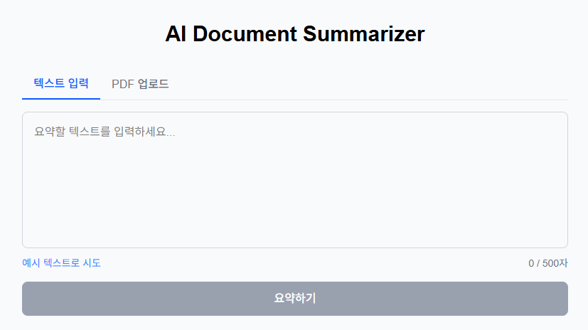

<!--
velog 발행용 초안
- 시리즈: 완벽주의 대신 완성
- 제목: 완벽주의 대신 완성 — 2주 AI 서비스 개발 회고
- 태그: 회고, SpringBoot, Nextjs, ClaudeAPI, 사이드프로젝트
- 썸네일: docs/images/summarize.png 권장
- 이미지: 아래 경로는 repo 기준 상대경로입니다. velog 발행 시 이미지를 직접 업로드해 URL을 교체하세요.
-->

# 완벽주의 대신 완성 — 2주 AI 서비스 개발 회고

> **완벽주의 대신 완성** 시리즈 — 배포까지 끝내는 걸 목표로 한 사이드 프로젝트 기록. 이번 편은 그 첫 번째, "2주 만에 AI 문서 요약 서비스 만들기"입니다.

## 들어가며

사이드 프로젝트를 시작하면 늘 같은 곳에서 멈췄다. 패키지 구조를 며칠 고민하고, 예외 처리 전략을 설계하고, 아직 필요하지도 않은 추상화를 미리 만들다가 — 정작 배포는 못 한 채 흥미가 식었다.

이번엔 규칙을 하나 정하고 시작했다.

> **완벽한 코드가 아니라 완성된 서비스.**

2주라는 타임박스를 걸고, "완벽주의 금지 / 과설계 금지 / 하루 최소 1 커밋 / Day 7 이전 반드시 배포"를 운영 원칙으로 못 박았다. 그리고 개발 전 과정에서 AI 도구(Kiro-cli)를 적극 활용했다.

결론부터 말하면, **6일 만에 인터넷에서 동작하는 서비스가 됐고 2주 안에 마무리까지 끝냈다.** 이 글은 그 2주의 타임라인과 삽질, 그리고 "완성 우선" 원칙이 실제로 어떻게 작동했는지에 대한 회고다.

## 무엇을 만들었나

**AI Document Summarizer** — 텍스트나 PDF를 넣으면 AI가 세 가지로 정리해주는 서비스다.

- **summary**: 2~3문장 요약
- **keyPoints**: 핵심 포인트 (3~5개)
- **actions**: 실행할 액션 아이템 (0~3개)

🔗 **Live Demo:** https://ai-summarize-sigma.vercel.app

| 메인 화면 | 요약 결과 | PDF 업로드 |
|:---:|:---:|:---:|
|  |  |  |

텍스트 입력은 물론, PDF를 드래그앤드롭하면 텍스트를 추출해 그대로 요약해준다. 결과 카드는 클립보드 복사 버튼도 있다.

## 기술 스택 & 아키텍처

| 영역 | 기술 |
|------|------|
| Backend | Java 21, Spring Boot, Gradle |
| Frontend | Next.js, TypeScript, TailwindCSS |
| AI | Claude API (`claude-haiku-4-5-20251001`) |
| PDF 처리 | Apache PDFBox |
| 배포 | Render (Backend), Vercel (Frontend) |
| 개발 도구 | Kiro-cli |

구조는 단순하다. 프론트가 백엔드를 부르고, 백엔드가 Claude를 부른다. PDF면 그 앞에 PDFBox로 텍스트를 뽑는 단계가 하나 더 붙는다.

```
Browser (Next.js/Vercel)
    │  POST /api/summarize
    ▼
Spring Boot (Render) ──▶ Claude API (Anthropic)
    │
    │ PDF 업로드 시
    ▼
  PDFBox (텍스트 추출)
```

의도적으로 큐, 캐시, DB를 넣지 않았다. 요약 결과를 저장하는 히스토리 기능도 "선택"으로 미뤄뒀다가 결국 스킵했다. **핵심 플로우가 동작하는 게 먼저**였기 때문이다.

## 2주 타임라인

| Day | 한 일 | 결과 |
|-----|------|------|
| 1 | Spring Boot 세팅, `POST /api/summarize` | 백엔드 뼈대 |
| 2 | Claude API 연동 (OkHttp) | AI 요약 응답 성공 |
| 3 | 프롬프트 구조화(JSON), Next.js, 연동 | 전체 플로우 동작 |
| 4 | CORS 글로벌화, 에러/로딩 UI, 카드 디자인 | UX 기본기 |
| 5 | Docker 멀티스테이지, 환경변수 분리 | 배포 인프라 준비 |
| 6 | Render + Vercel 배포 | **첫 배포 완료** 🎉 |
| 7 | 입력 500자 제한, 타임아웃, 에러 계층 정리 | 안정화 (Week 1 종료) |
| 8 | PDF 업로드(PDFBox), 복사/예시/반응형 | 기능 확장 |
| 9 | (스킵) 요약 히스토리 | 완성 우선 판단 |
| 10 | README 개편, 아키텍처, 스크린샷 | 문서 정리 |
| 11~14 | 회고 블로그, 최종 점검, 발행 | 마무리 |

Day 1에 시작해서 Day 3에 이미 "텍스트 입력 → AI 요약 → 결과 표시" 전체 플로우가 돌았고, Day 6에 배포가 끝났다. 나머지 절반(Day 7~14)은 안정화·기능 확장·기록에 썼다. **먼저 완성하고, 남은 시간에 다듬는** 순서가 핵심이었다.

## 삽질 하이라이트 4선

2주 내내 순탄하진 않았다. 시간을 가장 많이 잡아먹은 네 가지.

### 1) SSL `trustAnchors` 오류

Claude API 첫 호출부터 `trustAnchors parameter must be non-empty`가 터졌다. 회사 내부망 SSL 프록시의 루트 CA가 Java `cacerts`에 없었고, `keytool`로 등록하는 과정에서 `cacerts` 비밀번호 상태까지 꼬였다.

- **해결:** 프록시 루트 CA를 `cacerts`에 등록 + JVM 옵션에 `-Djavax.net.ssl.trustStorePassword=changeit`
- 이 이슈는 Docker 환경(Day 5), Gradle 데몬(Day 8)에서 형태를 바꿔 계속 재등장했다. 별도 JVM은 모두 같은 함정을 밟았다.
- 📄 상세: `docs/troubleshooting/2026-05-04-ssl-trustanchors-issue.md`, `2026-05-10-docker-ssl-proxy-ca.md`, `2026-05-20-truststore-password-multiple-jvms.md`

### 2) 이미 폐기된 모델 ID (404)

AI가 생성해준 코드에 `claude-3-5-haiku-20241022`가 박혀 있었다. 호출하면 404. 이미 폐기된 모델이었다.

- **해결:** 유효한 `claude-haiku-4-5-20251001`로 교체
- **교훈:** AI의 학습 데이터는 과거 시점이다. **외부 API의 최신 상태는 반드시 직접 확인해야 한다.** AI가 짜준 코드도 공식 문서와 대조는 필수.
- 📄 상세: `docs/ai-issues/2026-05-04-claude-model-deprecation.md`

### 3) Claude가 JSON을 마크다운으로 감쌌다

"JSON만 응답하라"고 프롬프트에 못 박았는데, Claude가 친절하게 ```` ```json ```` 코드블록으로 감싸서 반환했다. Jackson 파싱에서 `JsonParseException`.

- **해결:** 파싱 전에 backtick 코드블록을 벗겨내는 방어 코드 추가
- **교훈:** LLM 출력은 100% 보장되지 않는다. **프롬프트로 형식을 유도하되, 코드로 방어하라.**
- 📄 상세: `docs/troubleshooting/2026-05-06-claude-markdown-response.md`

### 4) Vercel 배포 후 404

빌드는 성공했는데 접속하면 404. 페이지 자체가 안 떴다.

- **원인:** Framework Preset이 `Other`로 잡혀 있었다. Root Directory를 `frontend`로 지정하니 Next.js 자동 감지가 안 된 것.
- **해결:** Preset을 `Next.js`로 수동 지정 → 즉시 해결. 덤으로 루트의 빈 `package-lock.json`이 workspace root를 오인하게 만들어 삭제했는데, 이게 나중에 Turbopack 캐시 문제(`Can't resolve 'tailwindcss'`)로 이어져 `.next` 삭제로 마무리했다.
- 📄 상세: `docs/troubleshooting/2026-05-15-turbopack-cache-resolve.md`

## 2주 회고에서 배운 것

**1. "완성 우선"은 판단 기준이 된다.**
Day 9 히스토리 기능을 스킵할 때 망설이지 않았다. 핵심(텍스트/PDF 요약)이 이미 동작하니, 부가 기능보다 문서화가 더 가치 있다고 바로 판단할 수 있었다. 원칙을 미리 정해두면 매 순간의 의사결정이 빨라진다.

**2. AI 코드는 강력하지만 맹신은 금물.**
보일러플레이트 생성, 구조 잡기, 방어 코드 작성에서 AI는 시간을 크게 줄여줬다. 하지만 폐기된 모델 ID처럼 **"과거 시점 지식"이 그대로 코드에 박히는** 함정이 있었다. AI는 초안을, 검증은 내가.

**3. 삽질도 기록이다.**
SSL 이슈를 처음 만났을 때 바로 트러블슈팅 문서를 썼다. 덕분에 Docker에서, Gradle에서 같은 문제가 재등장했을 때 즉시 해결했다. 지금 이 회고 글도 그 기록들 위에서 빠르게 쓰였다.

**4. 과설계 금지는 생각보다 어렵다.**
`record` DTO 두 개로 시작하고, 환경변수는 프로퍼티 오버라이드로 끝내고, 아키텍처 다이어그램은 텍스트로 그렸다. "지금 필요한가?"를 계속 물었다. 습관적으로 손이 과설계로 가는 걸 의식적으로 멈추는 연습이었다.

## 남은 것 & 마치며

기능과 배포는 끝났고, 지금은 마무리 단계다. 다음 편에서는 **Kiro-cli로 개발하며 겪은 AI 활용 경험**(어떤 프롬프트가 잘 먹혔는지, AI가 어디까지 기여했는지)을 따로 정리할 예정이다.

2주 전의 나는 "완벽하게 만들자"였고, 지금의 나는 "일단 완성하자"다. 그 차이 하나로 처음으로 사이드 프로젝트를 배포까지 끝냈다.

**완벽주의 대신 완성.** 이 시리즈로 앞으로도 계속 완성해 나가려 한다.

🔗 **직접 써보기:** https://ai-summarize-sigma.vercel.app

---

*다음 편 예고 — 완벽주의 대신 완성 #2: Kiro-cli로 AI와 함께 개발한 2주 (준비 중)*
